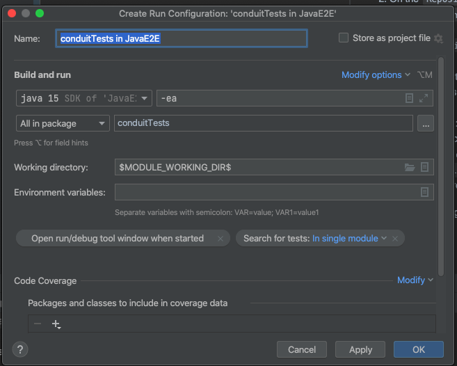

# Test Automation repo (JAVA)

## Status 

## Tools used:
### Playwright
It is a framework for Web Testing and Automation.

[Playwright Docs here](https://playwright.dev/java/docs/intro)

## Prerequisite
**Maven installed:**  

For Windows: [Windows install maven](https://maven.apache.org/install.html)

For mac: [MacOS install - Homebrew](https://formulae.brew.sh/formula/maven)

## How to run
(If maven is not installed, please install first)

1. Run `mvn clean install -DskipTests`  
2. Run `mvn clean test`

## IDE Setup:

- It requires `Java 8 or newer`.
- TestRunner is `JUnit 5`

### IntelliJ:
How to set up project:
1. Click on `File -> New -> Project from version control`
2. On the `Repository url` tab, provide the URL as `https://github.com/mayank1004/JavaE2E.git` and select `Clone` button
3. Click on the `File`, and select `Project Structure`
4. Please verify 
   1. The project SDK is set to java version 8 or above,
   2. In modules, `language level` needs to be 8 or higher version.
5. How to run test:
   1. Expand src/test/java/conduitTests.APITests
   2. Right click on UserServiceAPITest.java and select `Run UserServiceAPITest`
   
   *Note*: Make sure test runs without any error

Sample of run configuration:

### Eclipse 
1. Clone the repo.
2. Click on `File` -> `Open Projects from File System...` 
3. Select the directory as root of the repo
4. Now verify you see the project folder in `package explorer`
5. Now make sure project is set to java version 8 or above. You could verify that by:
   1. Right-click on the root of the project folder displayed and select `Properties`
   2. Go to Java compiler and verify JDK compliance is 1.8 or above
6. How to run test:
   1. Expand src/test/java/conduitTests.APITests
   2. Right click on UserServiceAPITest.java and select run as `Maven Test` or `JUnit Test`
   3. Tests should pass  
   *Note*: We use Test Runner `JUnit 5` for the project. (You could verify that by checking in `Run Configuration`)
   

## Test folder
[Test folder](src/test/java/conduitTests)

## More info
https://github.com/jossjacobo/react-redux-realworld-example-app
